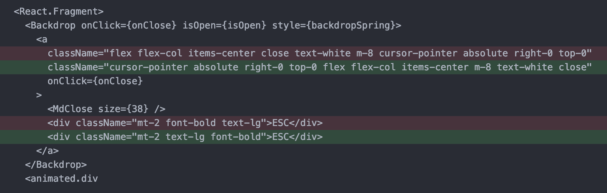

# eslint-jsx-classname


## Installation

```
yarn add --dev knoopx/eslint-plugin-jsx-classname
```

Add `jsx-classname` to your `.eslintrc`:

```
"plugins": [..., "jsx-classname"],
```

## Usage

Use one of the supplied configs

* `jsx-classname/tailwindcss`

by adding them to your `.eslintrc`:

```
"extends": [
  ...,
  "plugin:jsx-classname/tailwindcss"
],
```

Or use one of the above rules.

### jsx-classname/sort

Sorts `className` given specified patterns, falling back to alphabetical order.



Use the rule by adding it to your `.eslintrc`:

```
"jsx-classname/sort": [
  "warn",
  {
    "order": [
      "^display-"
    ]
  }
```
